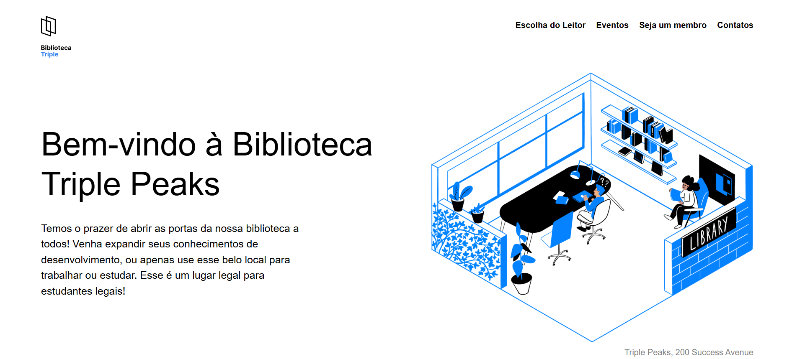

# Triple Peaks Library

## Live Demo

https://rodrigomzanetti.github.io/Web_project_library_Tripleten/

## Preview

## Overview

Triple Peaks Library is a front-end landing page developed as part of the TripleTen Web Development program. The project focuses on building a structured multi-section layout using semantic HTML and CSS.

The goal of the project was to practice layout organization, Flexbox alignment, and CSS positioning while following a design brief and maintaining a clear visual hierarchy across the page sections.

## Features

- Multi-section landing page with structured navigation
- Anchor links connecting different sections of the page
- Card-based layout for the “Staff Picks” book section
- Events section with layered composition using CSS positioning
- Membership section organized into step-by-step cards
- Footer with opening hours and social media links

## Technologies Used

- HTML5 – semantic structure and content organization
- CSS3 – layout styling and positioning
- Flexbox – alignment and spacing between elements
- CSS positioning – layered elements in the events section
- Normalize.css – cross-browser consistency
- BEM methodology – scalable CSS naming structure

## Project Structure

Web_project_library_Tripleten/

- index.html – main page markup
- styles/style.css – main stylesheet
- vendor/normalize.css – CSS reset for browser compatibility
- images/ – project assets (SVG and PNG files)
- favicon.ico – browser tab icon

## How to Run the Project

- Clone the repository
git clone https://github.com/RodrigoMZanetti/Web_project_library_Tripleten.git

- Navigate to the project folder
cd Web_project_library_Tripleten

- Open the project
Open **index.html** in your browser or run a local development server if preferred.

## Status

Completed as part of front-end development training.

## Problem Solving

One of the main challenges in this project was structuring a complex multi-section layout while keeping the design visually balanced. This was achieved using Flexbox for alignment and spacing, combined with CSS positioning for layered visual elements.

Special attention was given to organizing the layout into reusable sections and maintaining consistent spacing, typography, and visual hierarchy across the page.

## What I Learned

During this project I practiced:

- Structuring landing pages using semantic HTML sections
- Creating layouts using Flexbox for alignment and spacing
- Applying CSS positioning to layer visual elements
- Organizing styles using the BEM methodology
- Structuring front-end projects with clear folders and assets

## Author

Rodrigo M. Zanetti

GitHub  
https://github.com/RodrigoMZanetti

LinkedIn  
https://www.linkedin.com/in/rodrigomzanetti
